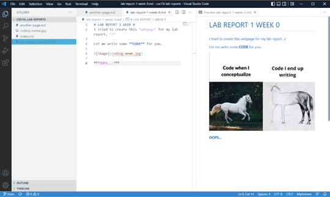
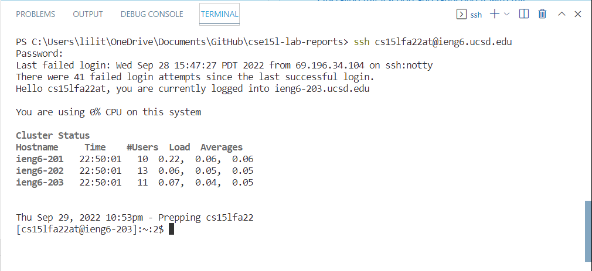
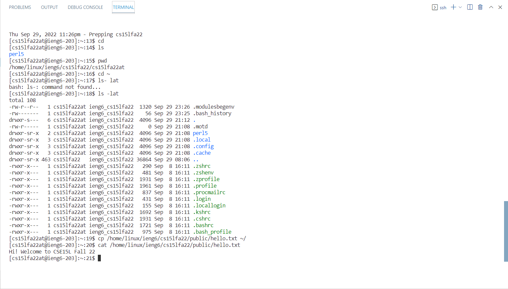
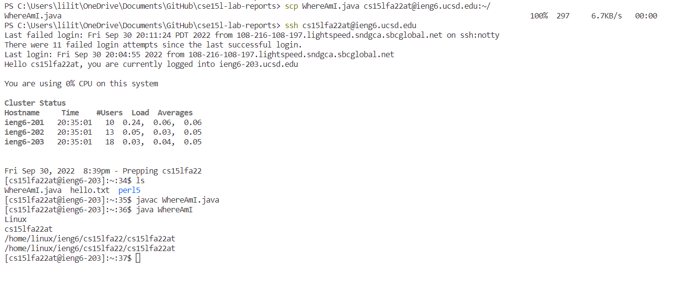
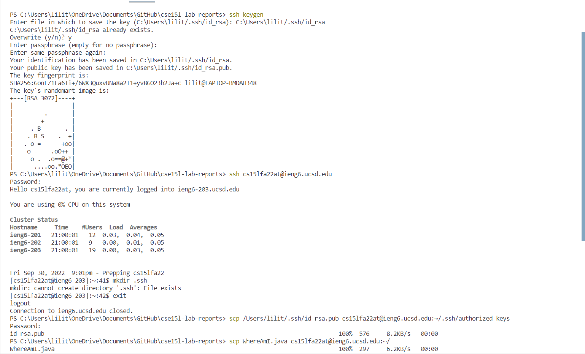
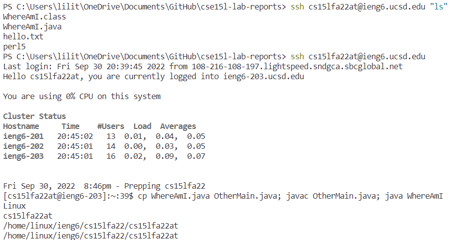

# Week 1 Lab Report
## 1. Installing VScode

I downloaded VSCode through https://code.visualstudio.com/ with the windows version. After that, I installed VScode under Users/username/Program for setting up. I also create a desktop shortcut for easier access. Then, I launched it with my GitHub Desktop for my lab report repository. This is the screenshot showing what I did in my lab report at week 0.

## 2. Remotely Connecting

I logged in the remote connect by using my course account which is cs15lfa22at. I found it using the following link: https://sdacs.ucsd.edu/~icc/index.php. I then open the terminal with VScode with the shortcut keys "Ctrl + `". To login with the secure shell, I used the command "ssh + my user account in terminal, and then typed in my password after the line shown up. It failed in the lab session due to the password changing server issue, but I figured it out later at home.

## 3. Run Some Commands

In this step, I tried several command to see how it works. 
* cd - change to the online directory
* ls - list the original file exists in the directory
* pwd - print out what is in the directory
* ls -lat - tells you when you made the files
* cp - copy the file
* cat - print out the raw file

The result of these code are shown in the screenshot.

## 4. Moving Files with scp

I created a file called WhereAmI.java with the following code lines in it:

class WhereAmI {

&nbsp;&nbsp;&nbsp;public static void main(String[] args) {
&nbsp;&nbsp;&nbsp;&nbsp;&nbsp;&nbsp;&nbsp;System.out.println(System.getProperty("os.name"));
&nbsp;&nbsp;&nbsp;&nbsp;&nbsp;&nbsp;&nbsp;System.out.println(System.getProperty("user.name"));
&nbsp;&nbsp;&nbsp;&nbsp;&nbsp;&nbsp;&nbsp;System.out.println(System.getProperty("user.home"));
&nbsp;&nbsp;&nbsp;&nbsp;&nbsp;&nbsp;&nbsp;System.out.println(System.getProperty("user.dir"));
}

}

and uploaded it to VScode for manipulation. After that, I use scp by typing command "scp + file + user account:~/" to save copy the file to the remote directory. Then, I used the command "javac + WhereAmI.java" and "java + WhereAmI" to access the file.

## 5. Setting an SSH Key

I followed the instruction to install the key in my terminal. After this, I can save time entering my password when I used the scp command. Super helpful!:)

## 6. Optimizing Remote Running

I used the example command to access the file, and it is really quick to access since it only use one line. First, I need to log in through ssh. Then, I write cp, javac, and java command in one line and it works. 