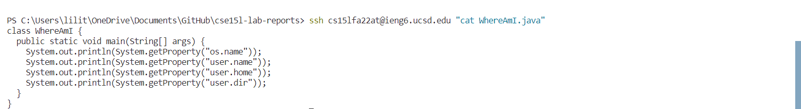

# Week 1 Lab Report
## 1. Installing VScode

I downloaded VSCode through https://code.visualstudio.com/ with the windows version. After that, I installed VScode under Users/username/Program for setting up. I also create a desktop shortcut for easier access. Then, I launched it with my GitHub Desktop for my lab report repository. This is the screenshot showing what I did in my lab report at week 0.

## 2. Remotely Connecting

I logged in the remote connect by using my course account which is cs15lfa22at. I found it using the following link: https://sdacs.ucsd.edu/~icc/index.php. I then open the terminal with VScode with the shortcut keys "Ctrl + `". To login with the secure shell, I used the command "ssh + my user account in terminal, and then typed in my password after the line shown up. It failed in the lab session due to the password changing server issue, but I figured it out later at home.

## 3. Run Some Commands

In this step, I tried several command to see how it works. 
* cd - change to the online directory
* ls - list the original file exists in the directory
* pwd - print out what is in the directory
* ls -lat - tells you when you made the files
* cp - copy the file
* cat - print out the raw file

The result of these code are shown in the screenshot.

## 4. Moving Files with scp

I created a file called WhereAmI.java with the following code lines in it:

class WhereAmI {

&nbsp;&nbsp;&nbsp;public static void main(String[] args) {
&nbsp;&nbsp;&nbsp;&nbsp;&nbsp;&nbsp;&nbsp;System.out.println(System.getProperty("os.name"));
&nbsp;&nbsp;&nbsp;&nbsp;&nbsp;&nbsp;&nbsp;System.out.println(System.getProperty("user.name"));
&nbsp;&nbsp;&nbsp;&nbsp;&nbsp;&nbsp;&nbsp;System.out.println(System.getProperty("user.home"));
&nbsp;&nbsp;&nbsp;&nbsp;&nbsp;&nbsp;&nbsp;System.out.println(System.getProperty("user.dir"));
}

}

and uploaded it to VScode for manipulation. After that, I use scp by typing command "scp + file + user account:~/" to save copy the file to the remote directory. Then, I used the command "javac + WhereAmI.java" and "java + WhereAmI" to access the file.

## 5. Setting an SSH Key

I followed the instruction to install the key in my terminal. First, I used "ssh-keygen" command to generate a key, and I entered the "/Users/username/.ssh/id_rsa" as a file to save the key. Then I entered the empty passphrase as instructed. Next, I logged in with "ssh + my account" command with password once, and used "mkdir. ssh" command to make a directory with ssh. Then, I logged off my account by entering "exit" and used 

"scp /Users/username/.ssh/id_rsa.pub  + account:~/.ssh/authorized_keys" 

command to save the key. I needed to enter my password once. After this, I can save time entering my password when I used the scp command. It is shown that I can use quick save-copy file command "scp + file name + my account:~/" for remote access without entering my password Super helpful!:)

## 6. Optimizing Remote Running

I firstly tried to used ssh command with one other single command. For example, I tried

ssh + username + "ls"

to list the files in the directory and it worked. It saved the time to used them separately. 

Also, I used the example command to access the file, and it is really quick to access since it only use one line. For example, I logged in through "ssh + username" command, since my laptop was not fully set up with java first week and I needed to operate on remote server. Then, I wrote 

"cp WhereAmI.java OtherMain.java; javac OtherMain.java; java WhereAmI" 

to save copy and access the file at the same time. Eventually, it printed out the lines for executing the WhereAmI.java file as the same results to used these three codes separately. 

We can also put any operating commands after the "ssh + username" to achieve login and operating files in one line. For example, I tried "ssh + username + "cat file", and it successfully printed out the codes in the file. 