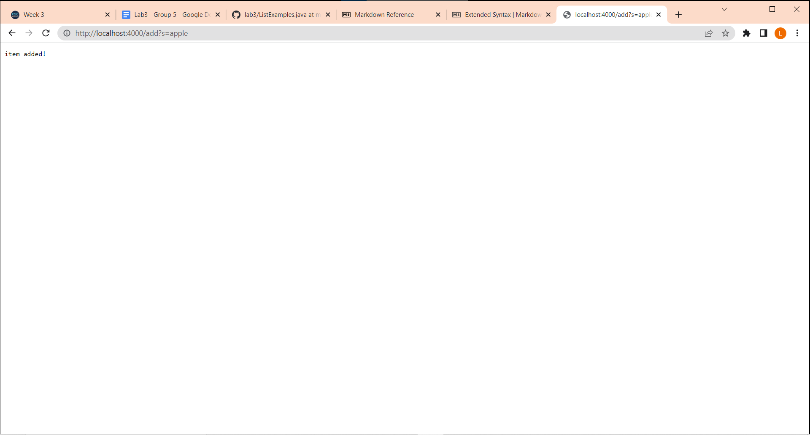
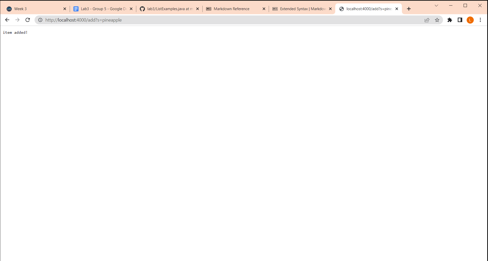
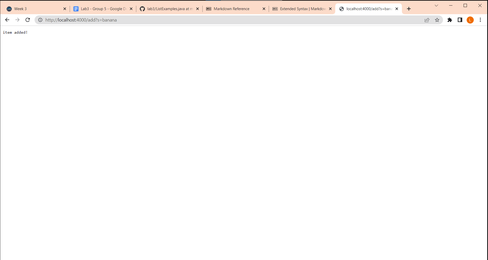
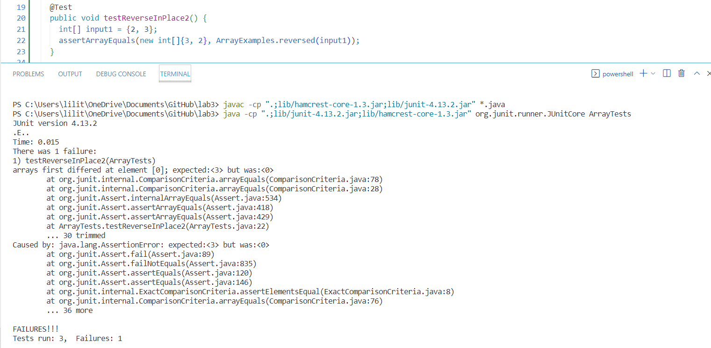
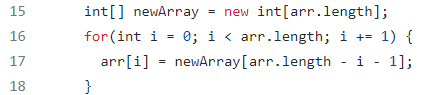
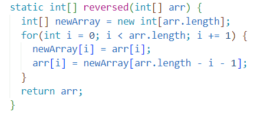
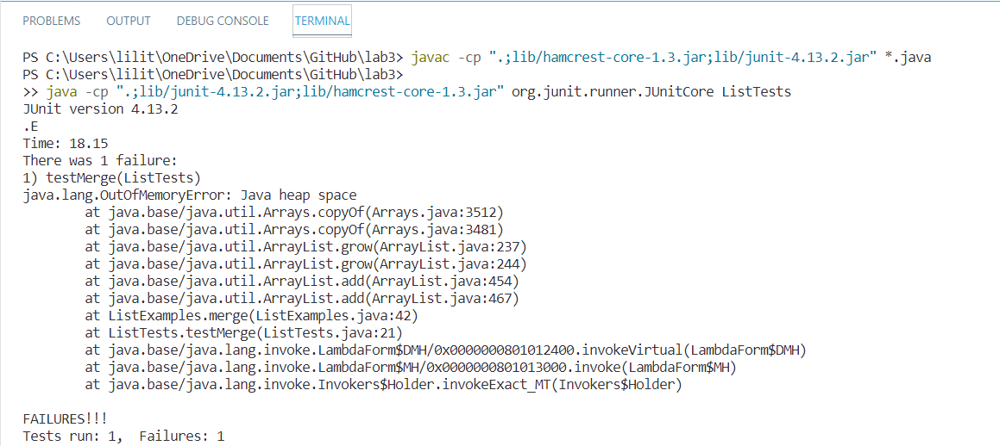
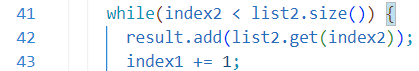
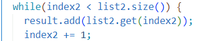

# Week 3 Lab Report
## Part 1. Simplest Search Engine
Here is my code:
```
import java.io.IOException;
import java.net.URI;
import java.util.*;

class Handler implements URLHandler{

    ArrayList<String> searchList = new ArrayList<String>();

    public String handleRequest(URI url) {
        if (url.getPath().equals("/")) {
            return String.format("Please add some items to the data base, or search for some items");
        } else {
            System.out.println("Path: " + url.getPath()); 
            if (url.getPath().contains("/add")) {
                String[] parameters = url.getQuery().split("=");
                if (parameters[0].equals("s")) {
                    searchList.add(parameters[1]);
                    return String.format("item added!");
                }
            } else if(url.getPath().contains("/search")) {
                String[] parameters = url.getQuery().split("=");
                if (parameters[0].equals("s")) {
                    int timeAppearance = 0;
                    String result = "";
                    String space =" ";
                    for (int i = 0; i < searchList.size(); i++) {
                        if (searchList.get(i).contains(parameters[1])) {
                            timeAppearance++;
                            result = result.concat(searchList.get(i));
                            result = result.concat(space);
                        }
                    }
                    if (timeAppearance != 0) {
                        return String.format(result);
                    } else{
                        return String.format("Item Not Found!");
                    }
                }
            }
        return String.format("404 Not Found!");
        }
    }
}

class SearchEngine {
    public static void main(String[] args) throws IOException {
        if(args.length == 0){
            System.out.println("Missing port number! Try any number between 1024 to 49151");
            return;
        }

        int port = Integer.parseInt(args[0]);

        Server.start(port, new Handler());
    }
}
```

Adding apple: 



This screenshot is using the method handleRequest. The process is activated by
```
if (url.getPath().contains("/add"))
```
a condition to check whether the url is called for adding items. Then, it called
```
String[] parameters = url.getQuery().split("=");
```
to separate the code after the add, which is "s" and the part after "=" apart. As it checked the left side of "=" being "s", it added the part after "=" to the array by activating the method:
```
searchList.add(parameters[1])
```
and return the statement "item added!"

Adding pineapple:

This screenshot is using the method handleRequest. The process is activated by
```
if (url.getPath().contains("/add"))
```
a condition to check whether the url is called for adding items. Then, it called
```
String[] parameters = url.getQuery().split("=");
```
to separate the code after the add, which is "s" and the part after "=" apart. As it checked the left side of "=" being "s", it added the part after "=" to the array by activating the method:
```
searchList.add(parameters[1])
```
and return the statement "item added!"

Adding banana:

This screenshot is using the method handleRequest. The process is activated by
```
if (url.getPath().contains("/add"))
```
a condition to check whether the url is called for adding items. Then, it called
```
String[] parameters = url.getQuery().split("=");
```
to separate the code after the add, which is "s" and the part after "=" apart. As it checked the left side of "=" being "s", it added the part after "=" to the array by activating the method:
```
searchList.add(parameters[1])
```
and return the statement "item added!"

Search words with "app":

This screenshot is using the method handleRequest. The process is activated by
```
else if(url.getPath().contains("/search"))
```
a condition to check whether the url is called for searching items. Then, it called
```
String[] parameters = url.getQuery().split("=");
```
to separate the code after the add, which is "s" and the part after "=" apart. As it checked the left side of "=" being "s", it uses the for loop to search whether the element is in the word at certain index. If it is, it adds the word to a return list by using concat method. 

## Part 2 Bugs

1.Failure from ArrayExamples:

reversed method:

Failure inducing input: {2, 3} as example; any array that has elements more than 1.

Symptom: The jUnit shows that the index at 0 is expected 3 but 0.

Note: I mistakely named the method "testReverseInPlace2" instead of naming according to the method "reversed". Since I don't have the original code anymore, I am not able to fix the name of the method in the screenshot. However, I'm here to clarify that "testReverseInPlace2" means to test the method "reversed" and it actually works as a unit test to test that method. I'm sorry for any confusion caused by the screenshot. 

Bug code (betweem line 15 to line 17):



Bug: In this method, the code in line 17 copies the elements in indices of new created int array *newArray* to the input array *arr* in corresponding position, causing the input array *arr* to store the elements of reversed new initialized array, which are zeros. 

Bug fixed code: 



2.Failure from ListExamples:

merge method:

Failure inducing input: {"apple", "mango", "pineapple"}, {"banana", "strawberry"}

Symptom: Out of Memory Error: java runs out of heap space.


Bug code (line 43):


Bug: In this method, the while-loop has a bug at the increment value. As the original code increase the value of index1 by 1 each while-loop, the condition-testing value index2 will never have chance of increment, and thus the while-loop will forever execute until java runs out of heap space. Hence, the increment in the while-loop in the code should be "index2 += 1" rather than "index1 += 1".

Fixed code:


