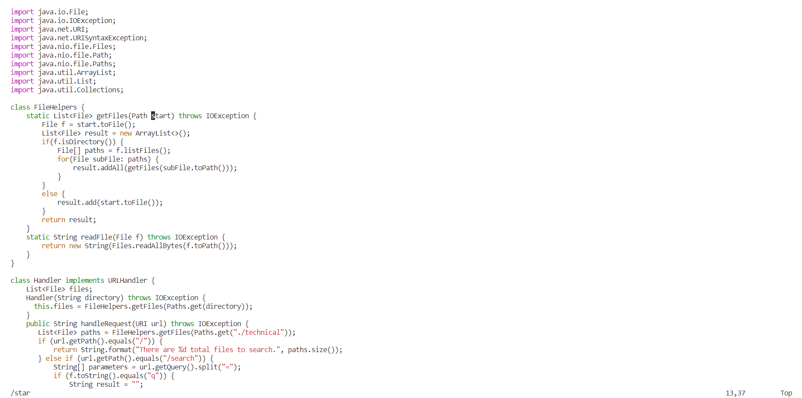
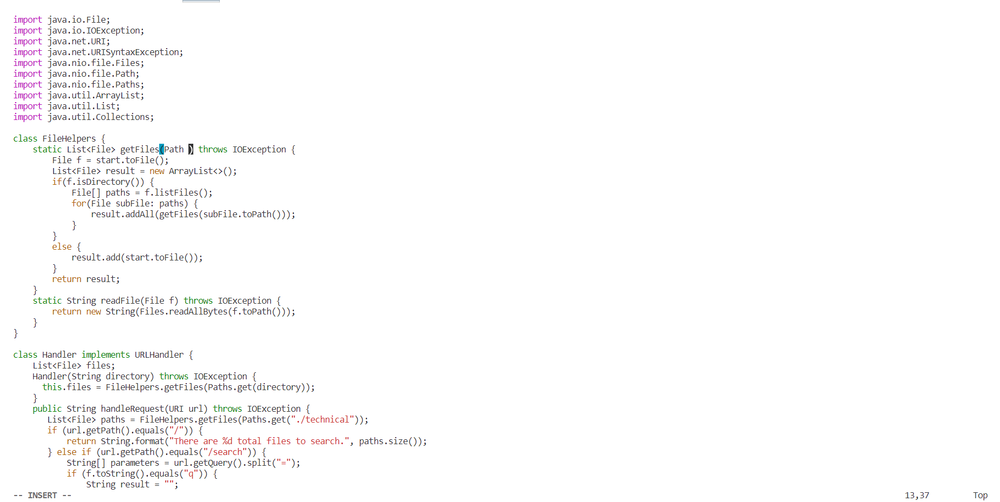
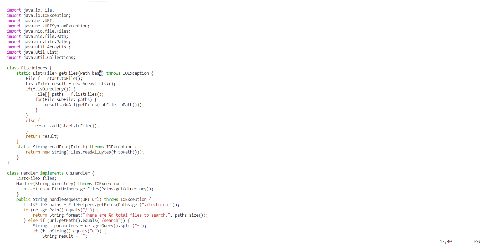
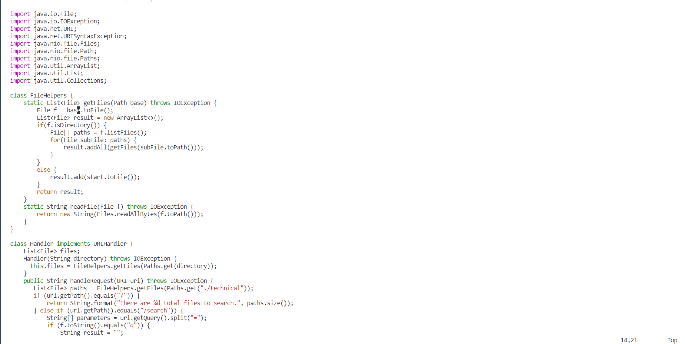
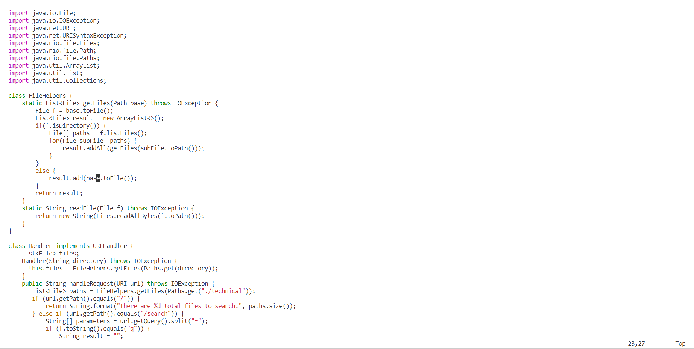
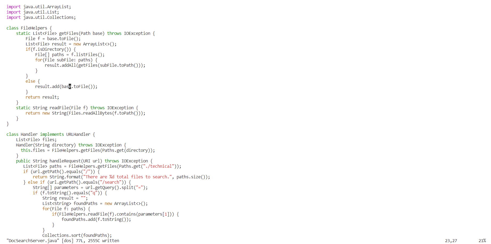

# Week 7 Lab Report

## Part 1

### Task Chosen: Changing the name of the start parameter and its uses to base

To access the file with vim methods, I used ```ssh cs15lfa22at@ieng6.ucsd.edu``` to login to my ieng6, and used ```cd week6-skill-demo1``` to change my directory to the cloned directory *week6-skill-demo1*. Then, I used ```vim DocSearchServer.java``` to access the file.

### The code I used to edit:

```/star<Enter>cebase<Esc>n.n.:w<Enter>```

Total Hit Counts: 19

### Step 1: ```/star<Enter>```



The vim command ```/star``` is used to search the word with key character "star". Since when I typed "star", it already jumped to the first "start" in the getFiles method, which is the parameter, so I didn't need to type "t" to save one hit. Then I hit ```<Enter>```, which goes to the first character at the first "star" in the document, which was what we needed. 

### Step 2: ```ce```



Then, I used the ```ce``` command to change from the cursor to the end of the word "start". So it deleted "start" and moved into "insert" mode. 

### Step 3: ```base<Esc>```



Next, I entered the word "base" which was what we wanted to change to and hit ```<Esc>``` to exit the insert mode after we changed the word already. It fixed the cursor at the last character of "base".

### Step 4: ```n```


After that, I used command ```n``` to find the next occurance of "star" in the document, since we search the pattern before. It stopped at the second pattern "star" in the document, and it was still in the method, so we decided to change the word. 

### Step 5: ```.```



We hit ```.``` to repeat the last command we did, which is ```cebase<Esc>``` to change the word from "start" to "base". It revealed the same result as predicted, just like how we changed the first "start" in the document. 

### Step 6: ```n.```



We found that there was still one "start" left in the method, so we repeated the command ```n.``` again to move the cursor to the next "start" in the document and change it to "base". Then we completed changing 3 "start" in the method to "base". 

### Step 7: ```:w```



Now we wanted to save the change, so we hit ```:w``` to save the change, and the result was like this screenshot. 

## Part 2

Firstly, I tried the first method to edit the server on VSCode and scp the file to the remote server. Just like what I did in the skill demonstration 1, I started with clonning the repository, and then opened the file named *DocSearchServer.java*. Then, I edited the line as it described in part 1. After that, I used ```scp DocSearchServer.java cs15lfa22at@ieng6.ucsd.edu:~/``` to save it on remote server and used ```javac``` to compile it and the *Server.java* ```java DocSearchServer``` to run it. It took me about 5 minutes to do so, and I did it real fast since I have been familiar to it through the skill demo. 

Then, I tried the second method, which is running on remote server and edited through vim. I did part 1 once and ran the script through ```bash test.sh```. It took me about 3 minutes to do it, and I felt much relax through the process. 

If I had to edit on remote server, I would choose to use vim, since it so much time to upload the files. Also, considering a repository containing a lot of files, I can save my time and space to download the repository to local, and instead to enjoy the benefit of the remote server. 

Some factors that might change my mind may be that I need to take screenshots and upload it to a folder, like the screenshots I did in this lab report. It is because I did not learn how to deal with pictures with vim command so far, and it really saved my time to use my mouse to select the exact size of screen I wanted, and to upload the screenshot by just dragging the .jpg file to the directory. Maybe some day I'll learn more and change my mind, but who knows? 